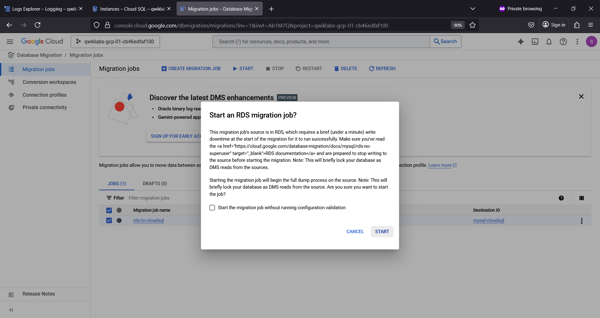

# rdscloudsql 🚚🚛
rdscloudsql : Amazon RDS to Google Cloud SQL Database Migration # MySQL

## Objective 
To perform MySQL one-time migration job using Database Migration Service.

## MySQL AWS RDS to Google Cloud SQL Database Migration

